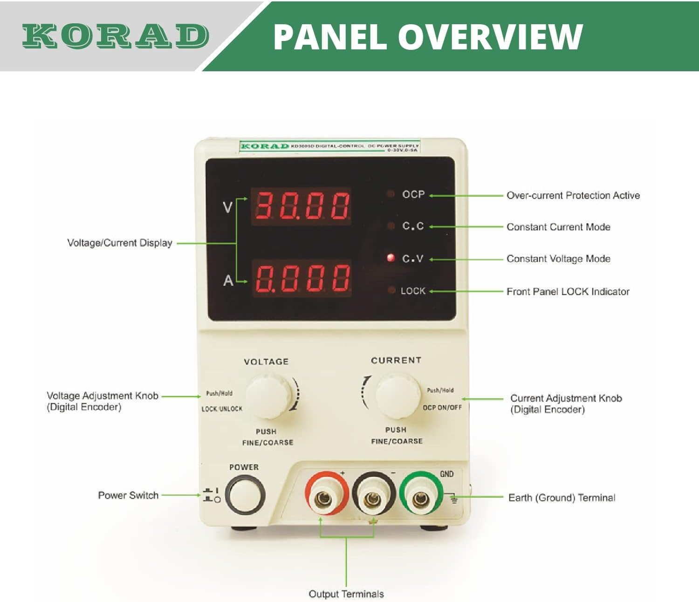

# MCP Server for *korad-KD3005P*

This MCP server allow the control of Korad KD3005P power supplies.



## Install the server

```bash
cargo install mcp-srv-korad-KD3005P
```

Or if you have cloned the repo

```bash
cargo install --path .
```

## Test in VsCode With Copilot

### Setup VsCode

`~/.vscode/mcp.json`

```json
{
  "servers": {
    "korad-KD3005P": {
      "type": "stdio",
      "command": "mcp-srv-korad-kd3005p",
    }
  }
}
```

With lulu-logs:

```json
{
  "servers": {
    "korad-KD3005P": {
      "type": "stdio",
      "command": "mcp-srv-korad-kd3005p",
      "args": [
        "--lulu",
        "127.0.0.1:1883"
      ]
    }
  }
}
```

### Run the tests

Inside the Agent chat use the prompt `/test-hw`

```bash
# into agent
/test-hw
# agent will test the connected power supply
```
